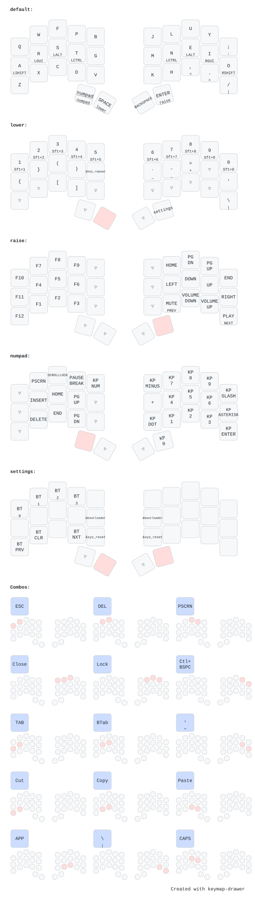

# Hardware
| Hardware | Links |
|:--:|:--:|
| Keyboard | [Aurora Sweep](https://splitkb.com/products/aurora-sweep)|
| Microcontroller |[Nice!Nano](https://splitkb.com/products/nice-nano)|
| Switches | [Sunset Kailh Low Profile Choc Switches](https://splitkb.com/products/sunset-kailh-low-profile-choc-switches) |
| Top Plate | [Black FR4](https://splitkb.com/products/aurora-sweep-low-profile-case?variant=43400797585667)
| Bottom Puck Plate | [Frosted Acrylic](https://splitkb.com/products/aurora-sweep-low-profile-case?variant=43400797782275)
| Tenting Puck | [Tenting Puck](https://splitkb.com/products/tenting-puck?) |
| Stands | [UGREEN Magsafe Phone Stand](https://www.amazon.co.uk/dp/B0CMHT5LZ5)|
| Feet | Stick on rubber feet |

Changed the tripods out for stands. They came with the magsafe rings which attached without issue to my acrylic base and won't interfere with my pucks if I decided to use them again.
It allows for a far better range of adjustability. I generally find that I end up using them at angles anywhere between 20%-45% tilt.

# Layout
This keyboard layout has been working quite well for me. Moving the `Tab` and `Shift Tab` combos off the default layer, as I found that I kept unintenitonally activating them when typing fast with the A-R-S keys. I don't find that any of the other combos activate unintentionally.

Been thinking about adjusting the keypress settings to somthing more balanced but haven't really had the time to compare between the settings.

[](https://caksoylar.github.io/keymap-drawer?keymap_yaml=H4sIAAAAAAACA7WWa1LbMBCA_3MKDT9wO5gWO-TlPmYcx5AUx3Fth0eBSZ3GFCYGZ2xnmBToMXqbXqYnqayVIgEhwZT6x-76s1ZarVayomAaTzINXf-4GPVH4XQQB8lQQ-k4Os9Gg34wSeIk6KdXYTi-XYmCaZik2gpCw_A0mERZbm6gz0TuE7lNpENkg8hPRFpE9og8JPIaj_pORmcakjTpdoZ0giyv1d72OXWB7vTanHnAdEto5wMzfNcCuENkZ9bAvt8gh-acntqEuXdG7AITYvtC5AGRBpFNIveI3CWyNfOXZAkm_F6Y8BtAHwX0lqDVm1WOLicX42BIOJhCHhzdgBlE8VWYwIeGbuySD3yStm9CGpPgPA3zZqS9xsNTIDzvNFtXeP-SyrEq4BLHJQFvcbwl4DLHZQFXOK4IuMpxVcA1jmsCrnNcF_Amx5uApWsJ9C3oV0S-BraGy7-fhOMwyCTeyVe6ZD-F9ZE2KOyL8AOF6wL88-u3jLLpONRQlgSXKQ0DP0uaLHA-onM4eX4fL__lGOZ-Iy1vTMhZGA2XNU3DLDu__J7iF1KyUKnbyiboKqgaqPqzw291O7BLnB3UtJnVgzPMtJt0VAX0FqgyqMqzR7XMbR8OjO4-DEpHdNs7LZ-OqVINir6V_mmhOj0fDgvHNfcA73WtXsfkgdB3Gk_u5Fj6IXGyzQP__5TQnaqAI05b4uR4hgsRY6NrWVbXgBPX0XueiRquqcP7roPsXoeZnbbd89hLlRk1ZtSZ4Vm611oSQtv2TNd_UEZC6ub7rbNBtphRZkaFGbqHD-y2t7ukq6Zpmb55p1h5IT_uhgdodn1mKsxQmVFiBvlvFN26C8fN9y_b23yNG_Dvxqf27QOmzGHqHFaS2AH7ImptEMdZFAfDMHmULFANH2-yPWYalnvvo33g017TaYr_PDgn0iNggXqRo_ZO02_xxSDGK7OBxho62pSRcoIbjfAVwsvvOBGG9P4nwxVChvNZpvv2hHoqMlKpJy7SIp6qjErUk23yJ_uWZVSRUZW6G1GchkXcc18Z1ai7FX8bFfGuyajORs6i9YbnFMtYnmyWbV9vUN-FLjjLCktzww8GT_HBYSosTnJ3wQ_soFWyg56-UDhglQVsTLJCvnl9sMiNeDwt5IxLRJ3VSJBmhRZZxausshLRHaeQL06eKibvWLytC93Mso1DVViohu54c1boZOUv1qHXmokNAAA%3D)